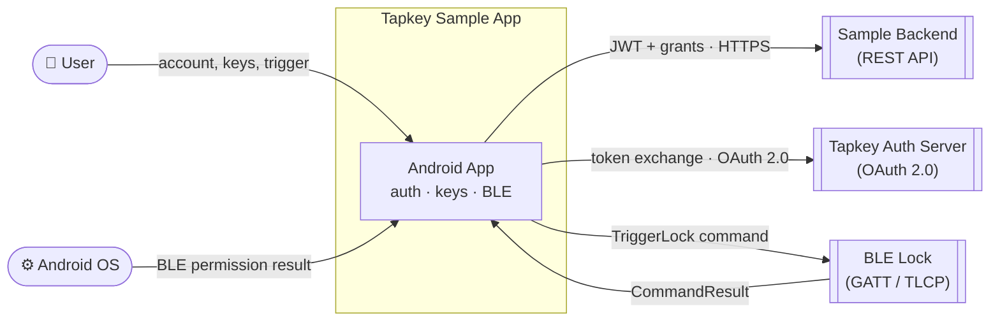

# android-sample-app — BLE Architecture Study Reference

> **Upstream status:** Officially discontinued by Tapkey. Current official reference: [tapkey-keyring-app-template-android](https://github.com/tapkey/tapkey-keyring-app-template-android).
> This fork is a personal study reference for BLE architecture patterns that inform a PWA relay design — see [CLAUDE.md](CLAUDE.md) for full context.

---

## System Context

The app sits between a user, a backend auth stack, and a physical BLE lock. This diagram shows what crosses each system boundary.

---

## Documentation

| Document | What it covers |
|----------|---------------|
| [CLAUDE.md](CLAUDE.md) | Study goals, checklist, project context, known limitations |
| [docs/USE_CASES.md](docs/USE_CASES.md) | All 9 use cases with class + sequence diagrams |
| [docs/study-checklist/](docs/study-checklist/README.md) | Phase 1 study checklist findings (SC1–SC10) |
| [docs/comparison-error-handling.md](docs/comparison-error-handling.md) | Error handling comparison vs. Tapkey App Template |
| [docs/ref-message-resolver.md](docs/ref-message-resolver.md) | Annotated `MessageResolver.kt` — full BLE error taxonomy |
