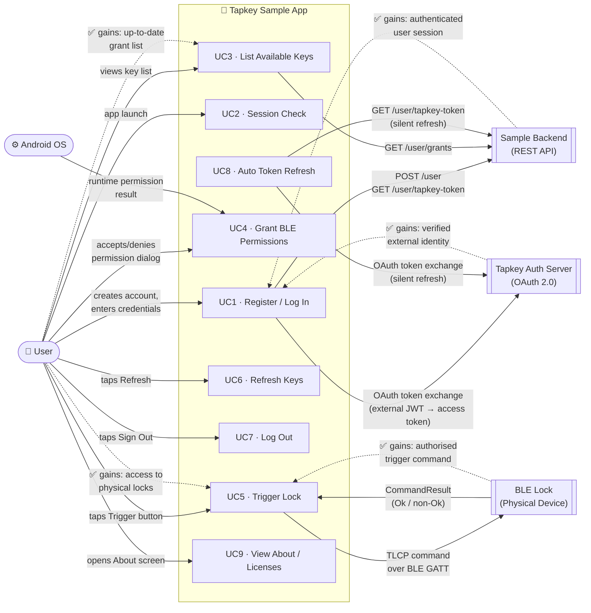

# android-sample-app — BLE Architecture Study Reference

> **Upstream status:** This sample is officially discontinued by Tapkey. The current official reference is [tapkey-keyring-app-template-android](https://github.com/tapkey/tapkey-keyring-app-template-android).
> This fork is maintained as a personal study reference for BLE architecture patterns — see [CLAUDE.md](CLAUDE.md) for context.

Reference documentation for the Tapkey Android SDK sample app. Each use case captures the actors, class relationships, and interaction sequence to support the parent project's Phase 1 BLE architecture study.

Diagrams are written in [Mermaid](https://mermaid.js.org/) and render natively in GitHub, VS Code (with the Mermaid extension), and most Markdown viewers.

---

## Summary Use Case Diagram

All actors, external systems, use cases, and what each actor gains from the interaction.

---

## Comparison Report

→ [docs/comparison-error-handling.md](docs/comparison-error-handling.md) — Error handling & BLE error coverage: this repo vs. the newer Tapkey App Template

## External Reference (annotated)

→ [docs/ref-message-resolver.md](docs/ref-message-resolver.md) — Annotated copy of `MessageResolver.kt` from the Tapkey App Template: full `CommandResultCode`, `ValidityError`, and exception-type mapping with PWA relay study notes

---

## Use Case Index

| # | Use Case | File |
|---|----------|------|
| UC1 | Register Account & Log In | [docs/uc1-login-registration.md](docs/uc1-login-registration.md) |
| UC2 | Session Check on App Launch | [docs/uc2-session-check.md](docs/uc2-session-check.md) |
| UC3 | List Available Keys | [docs/uc3-list-keys.md](docs/uc3-list-keys.md) |
| UC4 | Grant Runtime BLE Permissions | [docs/uc4-ble-permissions.md](docs/uc4-ble-permissions.md) |
| UC5 | Trigger Lock (Unlock via BLE) | [docs/uc5-trigger-lock.md](docs/uc5-trigger-lock.md) |
| UC6 | Refresh Keys (Poll for Notifications) | [docs/uc6-refresh-keys.md](docs/uc6-refresh-keys.md) |
| UC7 | Log Out | [docs/uc7-logout.md](docs/uc7-logout.md) |
| UC8 | Automatic Tapkey Token Refresh | [docs/uc8-token-refresh.md](docs/uc8-token-refresh.md) |
| UC9 | View About / Third-Party Licenses | [docs/uc9-about-licenses.md](docs/uc9-about-licenses.md) |

---

## Actor Glossary

| Actor | Meaning |
|-------|---------|
| **User** | Human end-user of the mobile app |
| **App** | The Android app (activities, fragments, managers under `net.tpky.demoapp`) |
| **Sample Backend** | Application-specific server issuing external JWTs and grant metadata |
| **Tapkey Auth Server** | OAuth 2.0 server that exchanges external JWTs for Tapkey access tokens |
| **Tapkey SDK** | On-device SDK exposing `UserManager`, `KeyManager`, `BleLockScanner`, `BleLockCommunicator`, `CommandExecutionFacade`, `NotificationManager` |
| **BLE Lock** | Physical Tapkey lock reachable via BLE GATT (SDK-opaque) |

## Cross-Cutting Notes

- **Auth persistence:** `AuthStateManager` stores username/password in `SharedPreferences` (plaintext) — used for Basic Auth to the Sample Backend *and* to power silent token refresh (UC8).
- **BLE is SDK-opaque:** GATT service UUIDs, characteristic reads/writes, and TLCP framing are hidden inside `BleLockCommunicator` and `CommandExecutionFacade`. This is the primary study limitation flagged for the parent project's PWA relay design.
- **Two async event streams** feed the key list: `KeyManager.getKeyUpdateObservable` (server-side grant changes) and `BleLockScanner.getLocksChangedObservable` (BLE proximity changes). They merge inside `KeyListFragment`.
