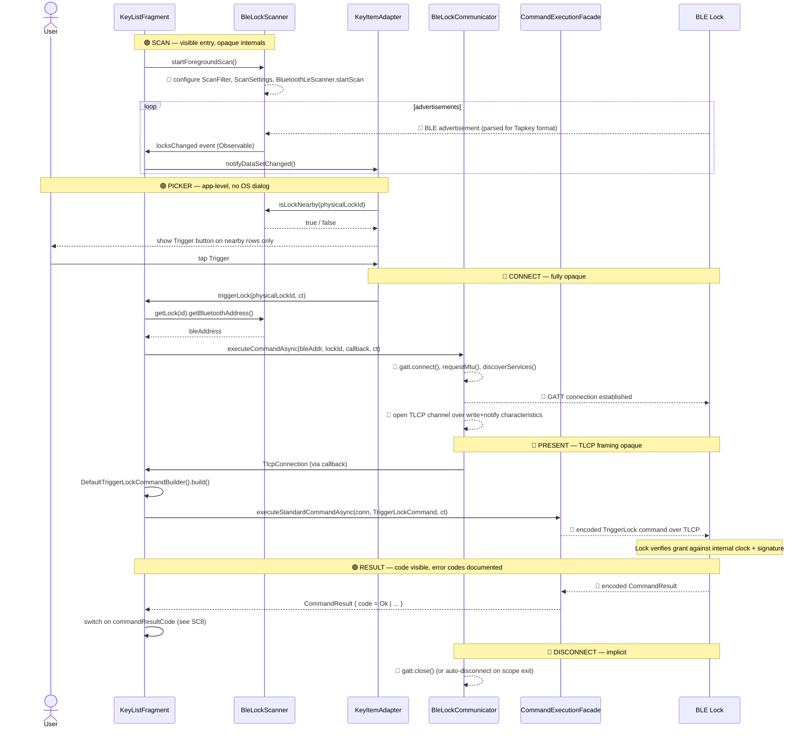

# SC6 — Full Interaction Map (scan → picker → connect → present → result → disconnect)

**Question:** Trace the full BLE interaction from scan to disconnect. Mark which steps are SDK-opaque.

**Legend:**
- 🟢 **Visible** — code we can read and reason about
- 🔴 **SDK-opaque** — hidden inside `BleLockScanner`, `BleLockCommunicator`, or `CommandExecutionFacade`

---

## Sequence

---

## What we can see vs. what we can't

| Phase | Visible surface | Opaque internals |
|-------|-----------------|------------------|
| **Scan** | `startForegroundScan()`, observable `locksChanged` events | ScanFilter/ScanSettings, advertisement parsing, RSSI thresholds, MAC randomisation handling |
| **Picker** | Full — this is app-level UI logic | (none) |
| **Connect** | `executeCommandAsync(bleAddr, lockId, ...)` entry point | `BluetoothGatt.connect`, MTU negotiation, service discovery, characteristic subscription |
| **Present** | Builder → command object → `executeStandardCommandAsync` | TLCP framing, encryption, session establishment, credential presentation |
| **Result** | `CommandResult.commandResultCode` enum | TLCP response decoding |
| **Disconnect** | Callback returns → SDK cleans up | `BluetoothGatt.close()`, timing, connection reuse |

**The entire security-critical portion (present + result decoding) is opaque.** The sample app tells us *nothing* about:
- What bytes go over the wire
- How the lock authenticates the phone
- How the phone authenticates the lock
- What replay protection looks like
- Whether the connection is encrypted below TLCP

The newer template (`tapkey-keyring-app-template-android`) exposes slightly more — the service UUID advertised (see [SC7](sc7-gatt-uuid-scan-filter.md)) and richer error codes (see [ref-message-resolver.md](../ref-message-resolver.md)) — but the wire protocol remains hidden.

---

## Comparison with Web Bluetooth (the parent project's target)

| Phase | Tapkey Android | Web Bluetooth PWA |
|-------|---------------|-------------------|
| Scan | continuous background scan, own picker | `navigator.bluetooth.requestDevice()` — OS picker per connection |
| Picker | filtered key list | OS-mediated dialog |
| Connect | `bleLockCommunicator.executeCommandAsync` | `device.gatt.connect()` |
| Present | TLCP framing (opaque) | app-authored writes to characteristics (**visible**) |
| Result | typed `CommandResult` enum | app parses response bytes (**visible**) |
| Disconnect | implicit | explicit `device.gatt.disconnect()` |

**The PWA relay's advantage is exactly at the opaque steps of the sample app:** every byte on the wire will be app-authored and observable. This directly satisfies the WBSO TK3 research constraint (see [ADR-0005](../../../Secure-datasharing-platform/ADR/adr-0005.md)).
