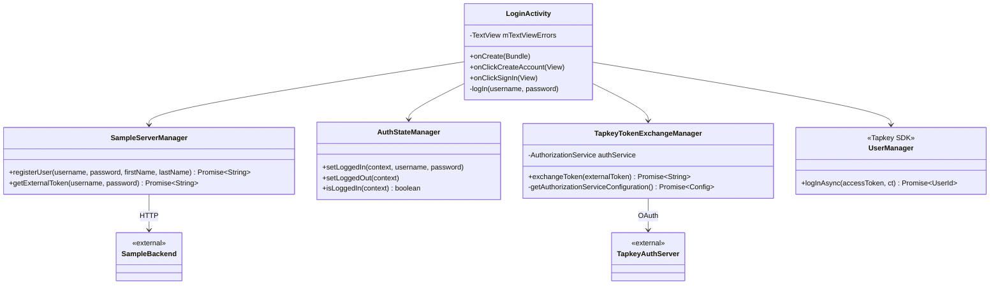
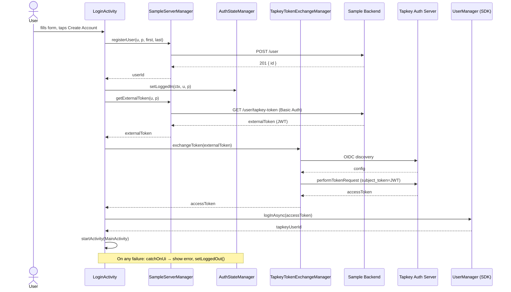

# UC1 — Register Account & Log In

Bootstrap authentication: user creates an account (or signs in) → app fetches an external JWT from the Sample Backend → exchanges it at the Tapkey Auth Server for a Tapkey access token → logs the user into the Tapkey SDK.

## Actors

- **User** — enters credentials in `LoginActivity`
- **App** — `LoginActivity`, `SampleServerManager`, `AuthStateManager`, `TapkeyTokenExchangeManager`
- **Sample Backend Server** — `POST /user`, `GET /user/tapkey-token`
- **Tapkey Auth Server** — OIDC discovery + OAuth `token_exchange`
- **Tapkey SDK** — `UserManager.logInAsync`

## Class Diagram

## Sequence Diagram

## Explanation

1. **Registration** — `LoginActivity.onClickCreateAccount` calls `SampleServerManager.registerUser`, which POSTs to `/user` on the Sample Backend. Sign-in skips this step.
2. **Local persistence** — Credentials are stored in `SharedPreferences` via `AuthStateManager.setLoggedIn`. These plaintext credentials are re-used for silent token refresh (UC8) and Basic Auth against the Sample Backend for grant queries (UC3).
3. **External token fetch** — `getExternalToken` calls `GET /user/tapkey-token` with HTTP Basic Auth. The backend returns a signed JWT that Tapkey will accept as a subject token.
4. **OAuth token exchange** — `TapkeyTokenExchangeManager.exchangeToken` first fetches OIDC discovery, then performs a `urn:ietf:params:oauth:grant-type:token-exchange` (custom grant `http://tapkey.net/oauth/token_exchange`) with scopes `register:mobiles`, `read:user`, `handle:keys`.
5. **SDK login** — `UserManager.logInAsync(accessToken)` registers the user with the Tapkey SDK, enabling all subsequent key/BLE operations.

## Error Paths

| Step | Failure | Handling |
|------|---------|----------|
| Registration | 4xx from backend (e.g., email in use) | `catchOnUi` → show message in `mTextViewErrors`, re-enable button |
| External token | Bad credentials | Same |
| Token exchange | Network / OIDC failure | Same, plus `AuthStateManager.setLoggedOut()` |
| SDK login | Tapkey SDK rejects token | Same |

## Files

- [app/src/main/java/net/tpky/demoapp/LoginActivity.java](../app/src/main/java/net/tpky/demoapp/LoginActivity.java)
- [app/src/main/java/net/tpky/demoapp/SampleServerManager.java](../app/src/main/java/net/tpky/demoapp/SampleServerManager.java)
- [app/src/main/java/net/tpky/demoapp/AuthStateManager.java](../app/src/main/java/net/tpky/demoapp/AuthStateManager.java)
- [app/src/main/java/net/tpky/demoapp/TapkeyTokenExchangeManager.java](../app/src/main/java/net/tpky/demoapp/TapkeyTokenExchangeManager.java)
- Layout: [app/src/main/res/layout/activity_login.xml](../app/src/main/res/layout/activity_login.xml)
