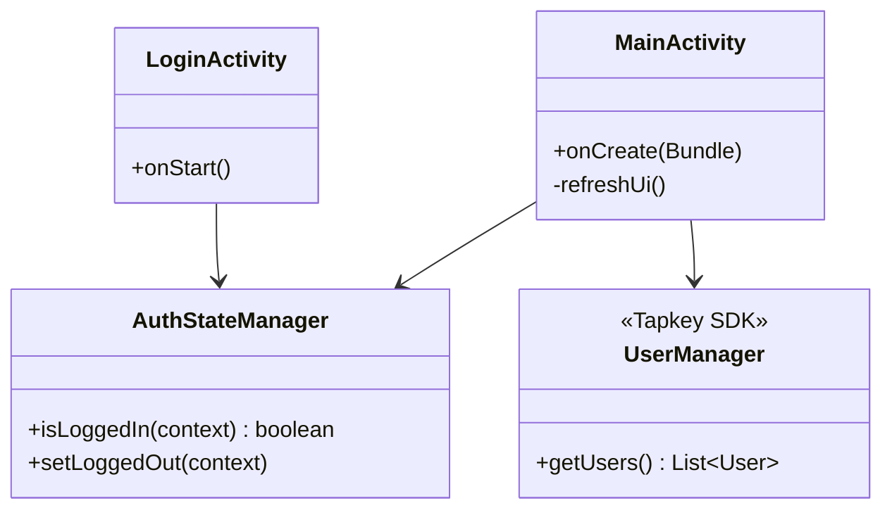
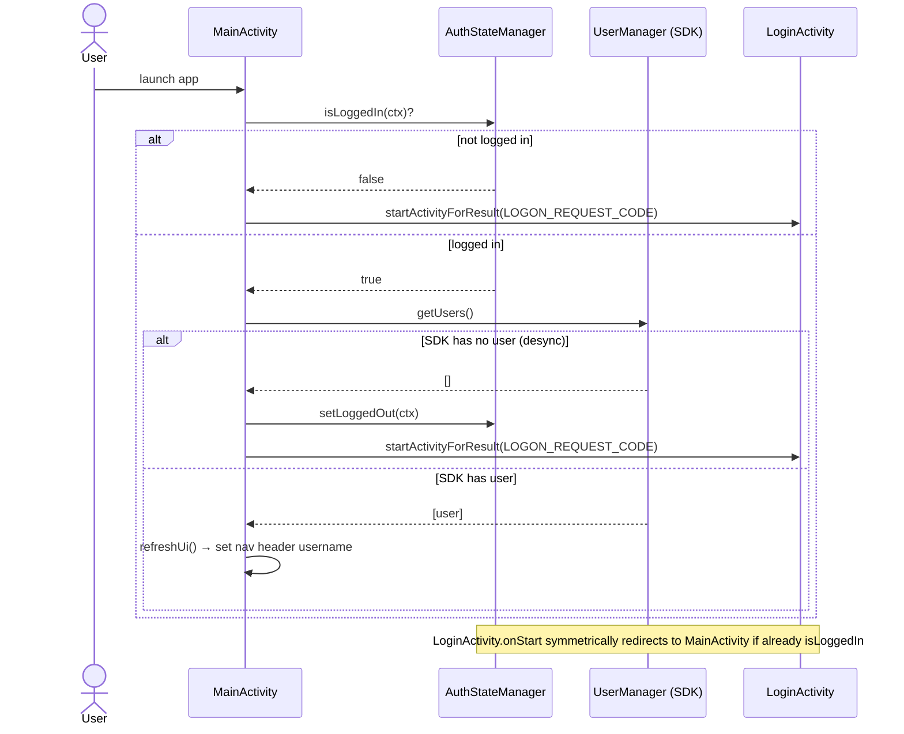

# UC2 — Session Check on App Launch

On app start, decide whether to route the user to `LoginActivity` or `MainActivity` based on both local credentials and Tapkey SDK user store.

## Actors

- **User** — passive
- **App** — `MainActivity`, `LoginActivity`, `AuthStateManager`
- **Tapkey SDK** — `UserManager.getUsers()`

## Class Diagram

## Sequence Diagram

## Explanation

Two guards must both agree that the user is logged in:

1. **Local guard** — `AuthStateManager.isLoggedIn(context)` checks `SharedPreferences`.
2. **SDK guard** — `UserManager.getUsers()` must return a non-empty list.

If local storage says "logged in" but the Tapkey SDK has no user (e.g., app data partially cleared), the app resets local state and forces re-login. This double-check is necessary because the two stores can drift.

`LoginActivity.onStart` performs the symmetric check: if a user reopens the login screen while already authenticated, they are bounced to `MainActivity`.

## Error Paths

| Condition | Result |
|-----------|--------|
| No local creds | Redirect to `LoginActivity` |
| Local creds but SDK empty | Clear local, redirect to `LoginActivity` |
| Both present | Continue to main UI |

## Files

- [app/src/main/java/net/tpky/demoapp/MainActivity.java](../app/src/main/java/net/tpky/demoapp/MainActivity.java)
- [app/src/main/java/net/tpky/demoapp/LoginActivity.java](../app/src/main/java/net/tpky/demoapp/LoginActivity.java)
- [app/src/main/java/net/tpky/demoapp/AuthStateManager.java](../app/src/main/java/net/tpky/demoapp/AuthStateManager.java)
