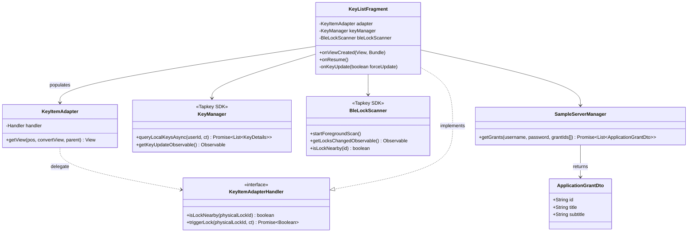
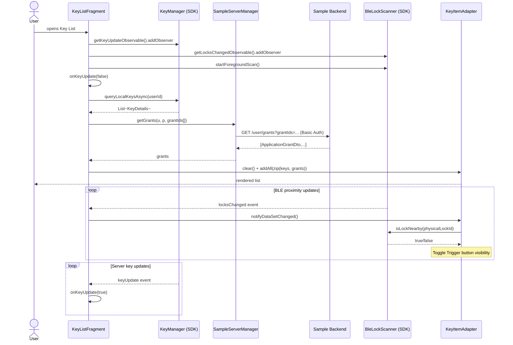

# UC3 — List Available Keys

Show the user their keys with grant metadata and live BLE proximity indicators.

## Actors

- **User** — passive viewer
- **App** — `KeyListFragment`, `KeyItemAdapter`, `SampleServerManager`
- **Tapkey SDK** — `KeyManager`, `BleLockScanner`
- **Sample Backend** — `GET /user/grants?grantIds=...`

## Class Diagram

## Sequence Diagram

## Explanation

1. **Two observers** are registered in `onResume`: one for server-side key changes (`KeyManager`), one for BLE proximity changes (`BleLockScanner`). They both feed into the same adapter but for different reasons.
2. **Local key query** — `queryLocalKeysAsync` returns keys already cached on-device. Server-side notifications (UC6) refresh this cache.
3. **Grant metadata** — Each `KeyDetails` carries a `grantId`. The Sample Backend enriches these with display-friendly titles/subtitles via `getGrants`, returning `ApplicationGrantDto`s.
4. **Zipping** — Fragment joins `KeyDetails` and `ApplicationGrantDto` by `grantId` into tuples pushed to `KeyItemAdapter`.
5. **BLE proximity** — `KeyItemAdapter.getView` calls back into `handler.isLockNearby(physicalLockId)` for every visible row. When BLE scanner fires, the fragment calls `notifyDataSetChanged`; only rows whose lock is currently in range show the Trigger button.

## Error Paths

| Step | Failure | Handling |
|------|---------|----------|
| `queryLocalKeysAsync` | Any | `catchOnUi` logs, list not updated |
| `getGrants` | HTTP failure | Same |
| No SDK user | Returns early | Logged only |
| `startForegroundScan` | Missing permission | Wrapped in try/catch; UC4 handles permissions |

## Files

- [app/src/main/java/net/tpky/demoapp/KeyListFragment.java](../app/src/main/java/net/tpky/demoapp/KeyListFragment.java)
- [app/src/main/java/net/tpky/demoapp/KeyItemAdapter.java](../app/src/main/java/net/tpky/demoapp/KeyItemAdapter.java)
- [app/src/main/java/net/tpky/demoapp/SampleServerManager.java](../app/src/main/java/net/tpky/demoapp/SampleServerManager.java)
- [app/src/main/java/net/tpky/demoapp/ApplicationGrantDto.java](../app/src/main/java/net/tpky/demoapp/ApplicationGrantDto.java)
- Layouts: [content_main.xml](../app/src/main/res/layout/content_main.xml), [key_item.xml](../app/src/main/res/layout/key_item.xml)
