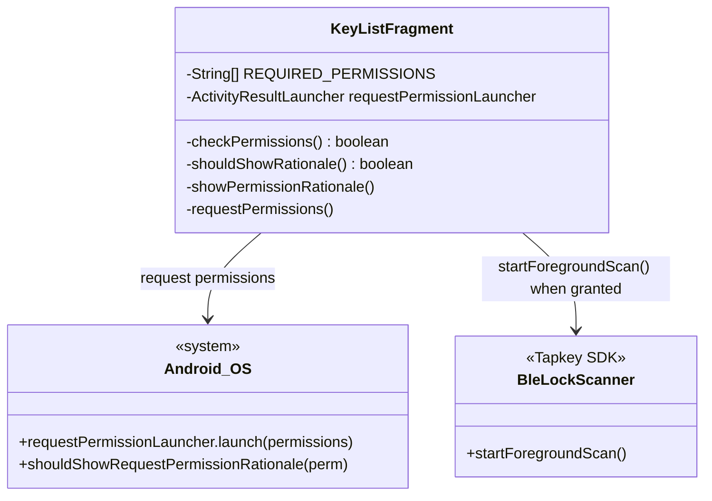
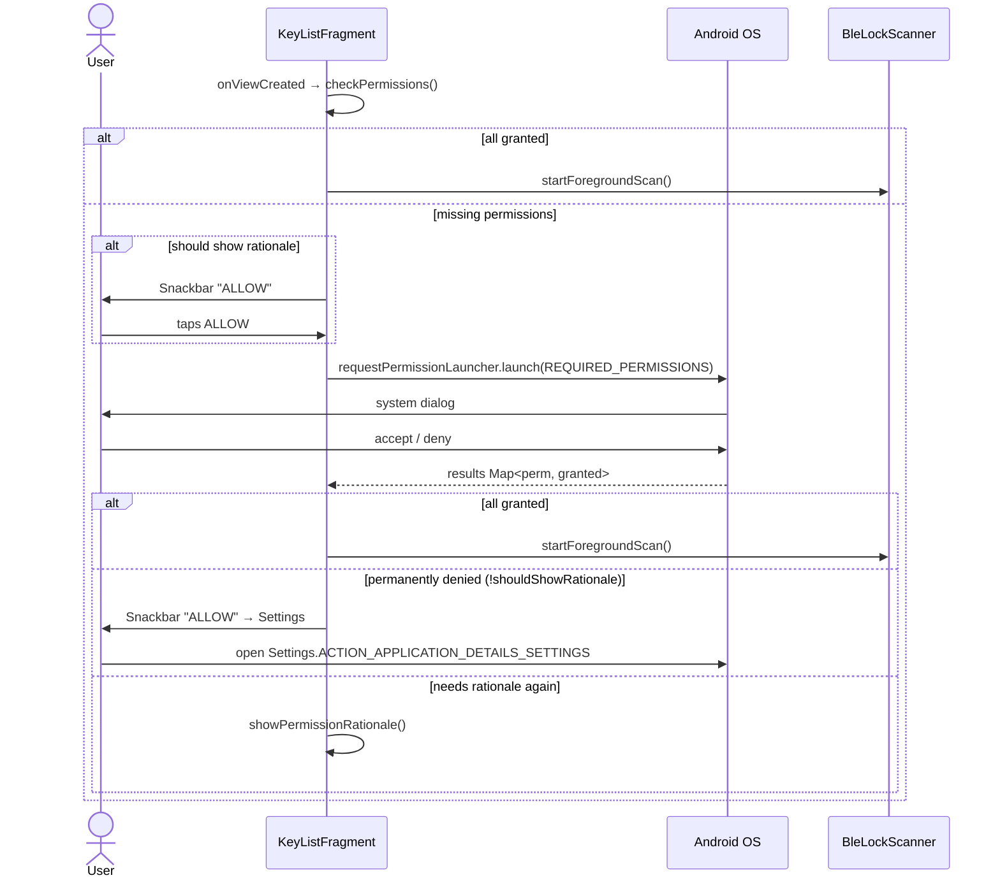

# UC4 — Grant Runtime BLE Permissions

Request the Android runtime permissions required to scan and connect over BLE. Required permissions depend on Android API level.

## Actors

- **User** — accepts/denies system permission dialog
- **App** — `KeyListFragment`
- **Android OS** — runtime permission subsystem

## Required Permissions by API Level

| Android version | Permissions |
|-----------------|-------------|
| API 31+ (Android 12+) | `BLUETOOTH_SCAN`, `BLUETOOTH_CONNECT` |
| API 29+ (Android 10+) | `ACCESS_FINE_LOCATION` |
| API 23+ (Android 6+) | `ACCESS_COARSE_LOCATION` |

## Class Diagram

## Sequence Diagram

## Explanation

1. **Permission set is API-level-aware** — `REQUIRED_PERMISSIONS` is built once with `Build.VERSION.SDK_INT` guards. Older phones need only location permissions; newer ones need explicit BLE permissions.
2. **Rationale-first UX** — Before triggering the system dialog, if Android reports that a rationale should be shown, the fragment displays a Snackbar. This avoids blindsiding the user.
3. **Permanent denial escape hatch** — If the user has clicked "Don't ask again", `shouldShowRequestPermissionRationale` returns false. The fragment then shows a Snackbar that opens the app's system settings page (`ACTION_APPLICATION_DETAILS_SETTINGS`) so the user can flip the permission manually.
4. **Gate for BLE scanning** — `BleLockScanner.startForegroundScan()` is only called after all required permissions are granted. Without it, UC3's proximity indicator never updates and UC5's Trigger button never appears.

## Error Paths

| Condition | Handling |
|-----------|----------|
| User denies once | Rationale Snackbar → re-prompt |
| User permanently denies | Snackbar → Settings intent |
| Permission granted after settings return | Foreground scan starts on next `onResume` |

## Files

- [app/src/main/java/net/tpky/demoapp/KeyListFragment.java](../app/src/main/java/net/tpky/demoapp/KeyListFragment.java) (lines ~64–83, ~160, ~263–333)
