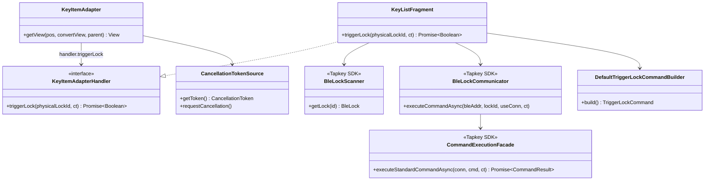
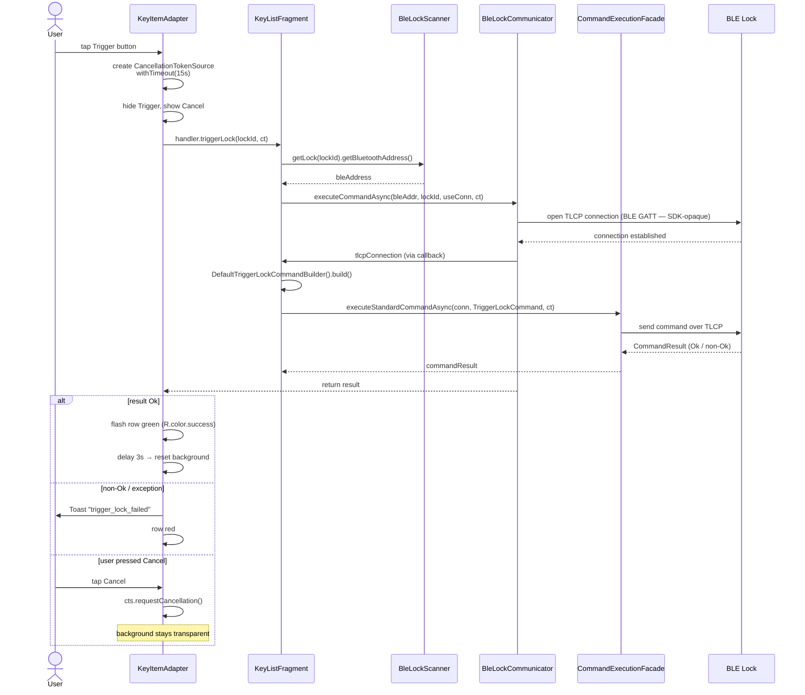

# UC5 — Trigger Lock (Unlock via BLE)

Send a `TriggerLockCommand` to a nearby BLE lock over a TLCP connection and reflect the result in the UI.

**Study note:** All BLE GATT operations (service discovery, characteristic reads/writes, framing) are opaque, buried inside `BleLockCommunicator.executeCommandAsync` and `CommandExecutionFacade.executeStandardCommandAsync`. No service UUIDs or scan filters are visible at the app layer — this is the primary limitation for the parent PWA-relay study.

## Actors

- **User** — taps Trigger button
- **App** — `KeyItemAdapter`, `KeyListFragment`
- **Tapkey SDK** — `BleLockScanner`, `BleLockCommunicator`, `CommandExecutionFacade`
- **BLE Lock** — physical Tapkey lock

## Class Diagram

## Sequence Diagram

## Explanation

1. **User action** — Only rows whose lock is nearby (see UC3) show the Trigger button. Tapping it kicks off a 15-second cancellable operation.
2. **Cancellation** — A `CancellationTokenSource` with a 15 s timeout is created. The user can also cancel manually via the Cancel button which calls `cts.requestCancellation()`.
3. **Address resolution** — `BleLockScanner.getLock(physicalLockId).getBluetoothAddress()` maps the Tapkey lock ID to its current BLE MAC address.
4. **Connection + command** — `BleLockCommunicator.executeCommandAsync` opens a TLCP (Tapkey Lock Communication Protocol) connection over BLE GATT and gives the caller back a `TlcpConnection`. The app then constructs a `TriggerLockCommand` via `DefaultTriggerLockCommandBuilder` and sends it via `CommandExecutionFacade.executeStandardCommandAsync`.
5. **Result** — `Ok` → flash green for 3 s, then reset. Non-Ok result codes currently produce a generic Toast (there is a TODO in the code to differentiate them). Any exception → red flash + Toast unless the user cancelled.

## Error Paths

| Cause | Handling |
|-------|----------|
| 15 s timeout | Cancellation propagates; red flash + Toast |
| User Cancel | `requestCancellation()`; background stays transparent |
| Non-Ok result code | Toast `R.string.key_item__trigger_lock_failed`, red flash |
| Any exception (BLE drop, TLCP error) | `catchOnUi` logs; red flash + Toast if not user-cancelled |

## Files

- [app/src/main/java/net/tpky/demoapp/KeyItemAdapter.java](../app/src/main/java/net/tpky/demoapp/KeyItemAdapter.java)
- [app/src/main/java/net/tpky/demoapp/KeyListFragment.java](../app/src/main/java/net/tpky/demoapp/KeyListFragment.java) (see `keyItemAdapterHandler.triggerLock`)
- Layout: [app/src/main/res/layout/key_item.xml](../app/src/main/res/layout/key_item.xml)
