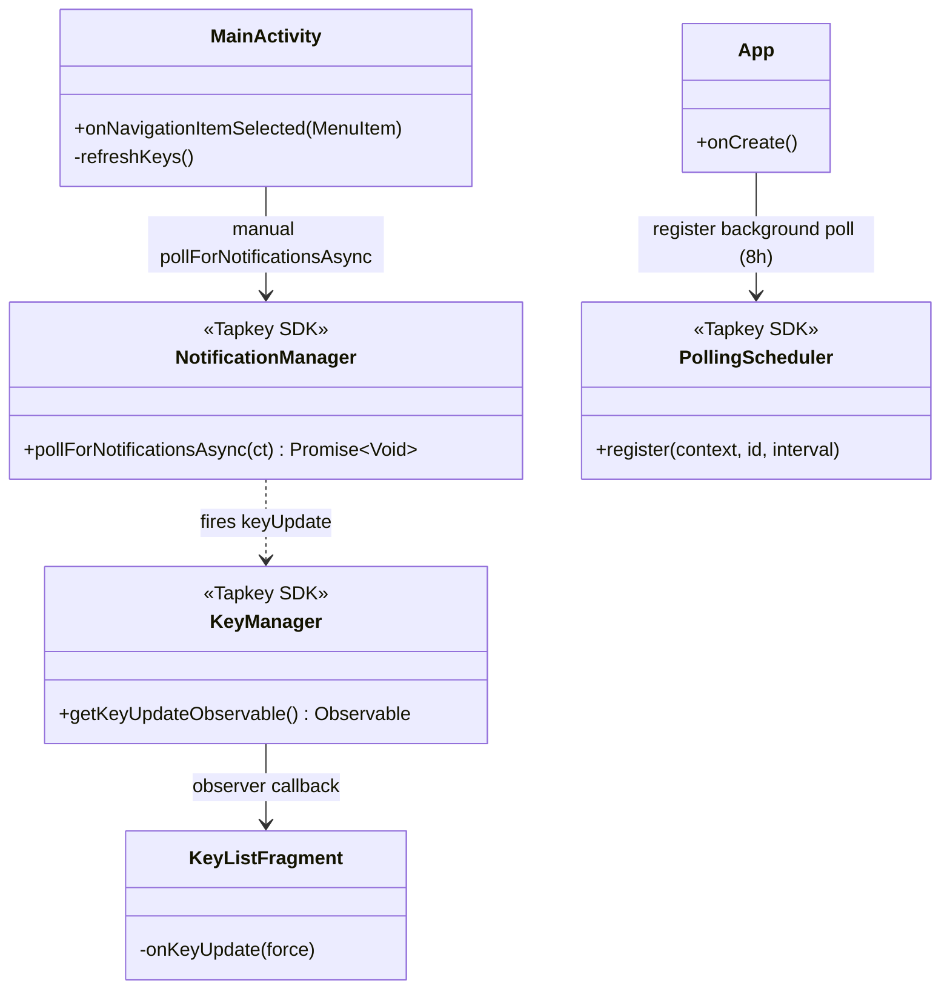
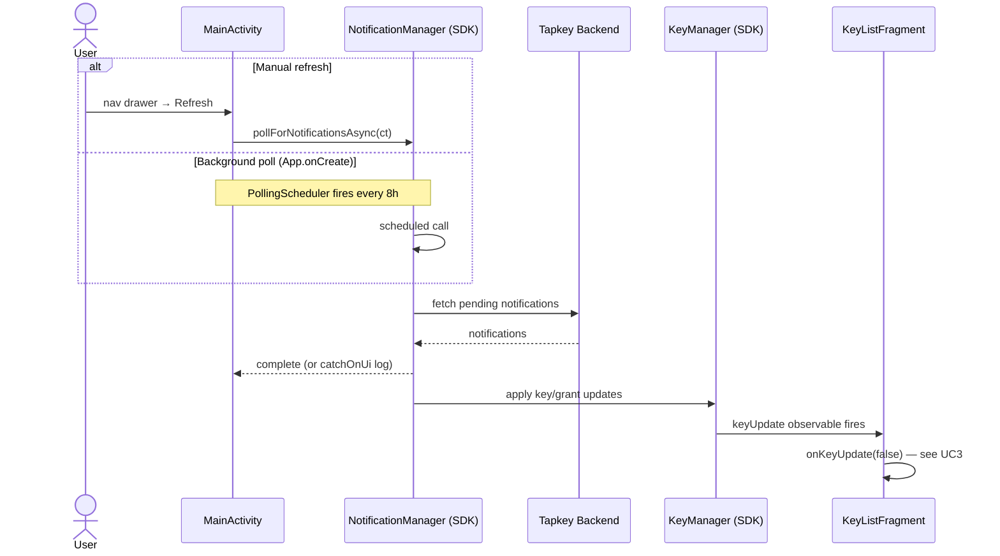

# UC6 — Refresh Keys (Poll for Notifications)

Trigger a poll to the Tapkey backend for pending notifications (typically new/revoked grants), which in turn refreshes the local key cache and UI.

## Actors

- **User** — taps Refresh menu item (manual path)
- **App** — `MainActivity`, `App` (background scheduler)
- **Tapkey SDK** — `NotificationManager`, `KeyManager`, `PollingScheduler`

## Class Diagram

## Sequence Diagram

## Explanation

1. **Two triggers, one flow:**
    - **Manual** — user taps Refresh in the nav drawer → `MainActivity.refreshKeys` → `pollForNotificationsAsync`
    - **Background** — `App.onCreate` registers a `PollingScheduler` at 8-hour intervals (`PollingScheduler.DEFAULT_INTERVAL`) so keys stay reasonably fresh without user action
2. **Effect** — Notifications from the Tapkey backend are applied to the SDK's local key store. Any change fires the `KeyManager` update observable, which `KeyListFragment` is already listening to (UC3), triggering `onKeyUpdate(false)` and a fresh grant fetch.
3. **Silent errors** — `pollForNotificationsAsync` errors are swallowed with a log; the user sees no direct feedback (Refresh menu simply completes).

## Error Paths

| Failure | Handling |
|---------|----------|
| Network error during poll | `catchOnUi` logs `"Error while polling for notifications."` |
| Any exception | `finallyOnUi` logs completion; no UI notification |

## Files

- [app/src/main/java/net/tpky/demoapp/App.java](../app/src/main/java/net/tpky/demoapp/App.java) (line ~43)
- [app/src/main/java/net/tpky/demoapp/MainActivity.java](../app/src/main/java/net/tpky/demoapp/MainActivity.java) (lines ~124–139)
