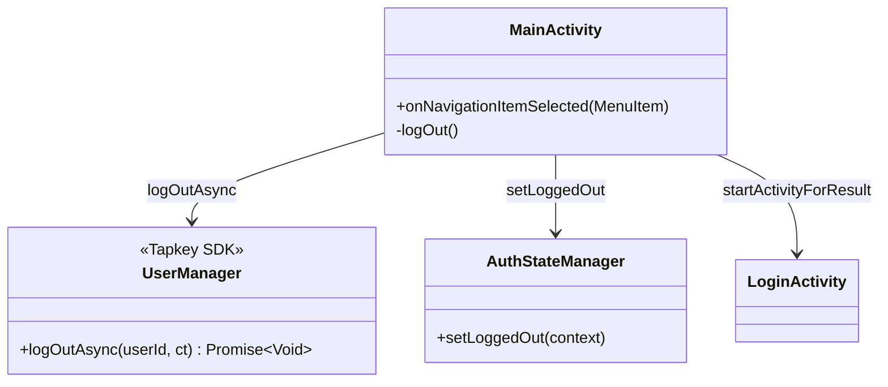
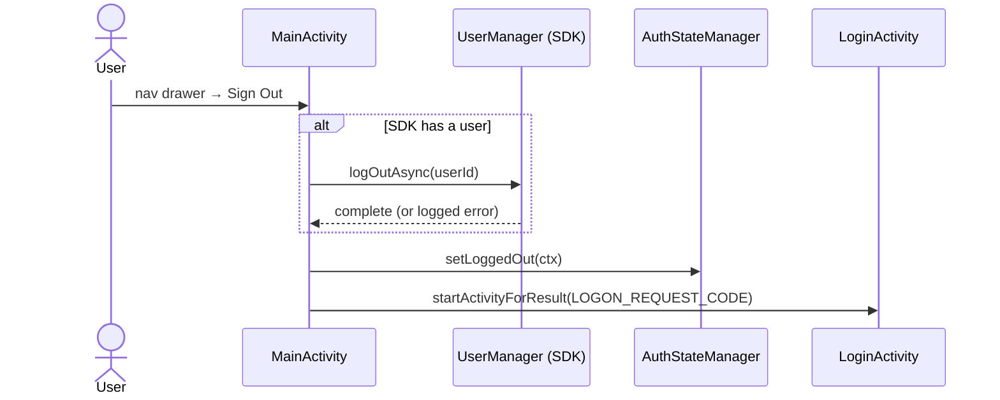

# UC7 — Log Out

Clear local credentials, log out of the Tapkey SDK, and return to `LoginActivity`.

## Actors

- **User** — taps Sign Out
- **App** — `MainActivity`, `AuthStateManager`
- **Tapkey SDK** — `UserManager.logOutAsync`

## Class Diagram

## Sequence Diagram

## Explanation

1. **SDK logout** — If a Tapkey user is present, `UserManager.logOutAsync` is called. This can fail but is treated as non-fatal.
2. **Local logout is unconditional** — `AuthStateManager.setLoggedOut(this)` always runs, clearing `SharedPreferences`. This ensures the user is fully logged out locally even if the SDK call fails.
3. **Redirect** — `LoginActivity` is started with the `LOGON_REQUEST_CODE`, replacing `MainActivity` in the back stack.

## Error Paths

| Failure | Handling |
|---------|----------|
| SDK `logOutAsync` throws | Logged as `"Could not log out user: ..."`; does not block local logout or redirect |

## Files

- [app/src/main/java/net/tpky/demoapp/MainActivity.java](../app/src/main/java/net/tpky/demoapp/MainActivity.java) (lines ~120, ~154)
- [app/src/main/java/net/tpky/demoapp/AuthStateManager.java](../app/src/main/java/net/tpky/demoapp/AuthStateManager.java)
