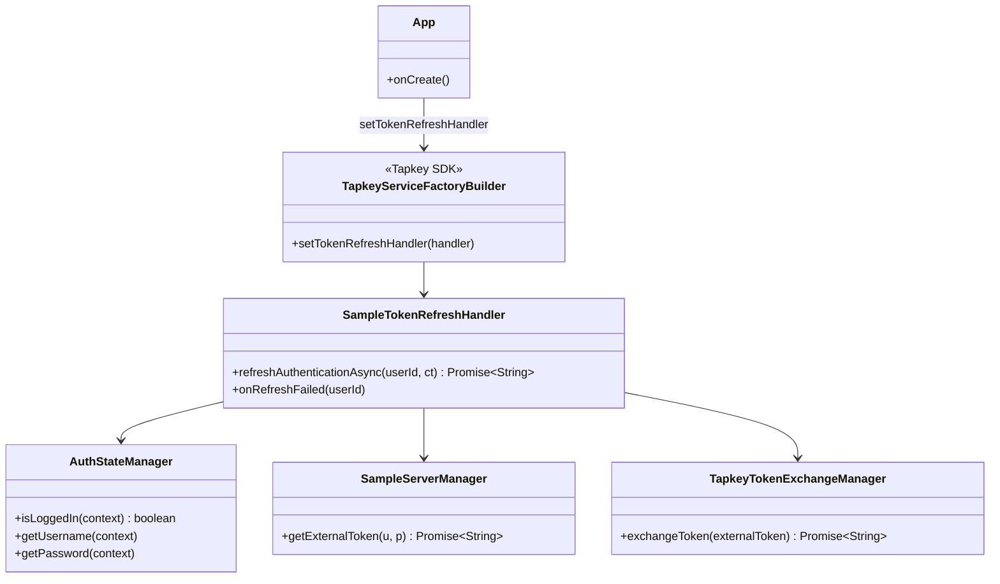
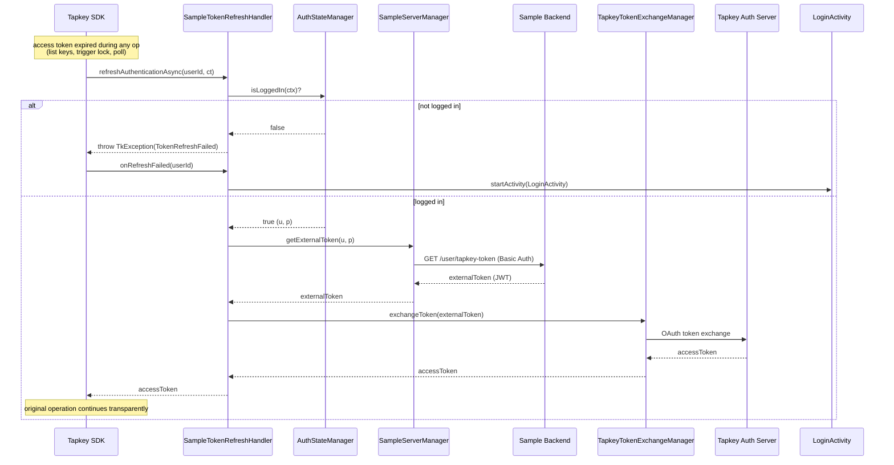

# UC8 — Automatic Tapkey Token Refresh

When the Tapkey SDK detects an expired access token during an operation, it invokes the app-registered refresh handler to silently obtain a new one — using the credentials persisted at login.

## Actors

- **App** — `App`, `SampleTokenRefreshHandler`, `SampleServerManager`, `TapkeyTokenExchangeManager`, `AuthStateManager`
- **Sample Backend** — `GET /user/tapkey-token`
- **Tapkey Auth Server** — OAuth token exchange
- **Tapkey SDK** — invokes handler transparently

## Class Diagram

## Sequence Diagram

## Explanation

1. **Registration** — At app startup, `App.onCreate` wires the handler via `TapkeyServiceFactoryBuilder.setTokenRefreshHandler(new SampleTokenRefreshHandler(this))`. From this point on, any expired token triggers the callback.
2. **Silent re-auth** — The handler mirrors the login flow (UC1) but without user interaction: fetch external token from Sample Backend (Basic Auth using stored username/password) → exchange for Tapkey access token → return.
3. **This is why passwords are persisted** — `AuthStateManager` stores credentials in `SharedPreferences` specifically so silent refresh works without prompting the user. This is a deliberate tradeoff (persisted password vs. UX) noted in the parent project's threat model.
4. **Failure escalation** — If refresh cannot complete (not logged in locally, or any exception), the handler throws `TkException(TokenRefreshFailed)`. The SDK then calls `onRefreshFailed`, which sends the user to `LoginActivity` to re-authenticate.

## Error Paths

| Cause | Handling |
|-------|----------|
| Not logged in locally | Immediate `TkException(TokenRefreshFailed)` |
| Backend down / bad creds (e.g., password rotated) | `catchOnUi` → `TkException(TokenRefreshFailed)` |
| SDK receives failure → calls `onRefreshFailed` | Handler starts `LoginActivity` |

## Files

- [app/src/main/java/net/tpky/demoapp/App.java](../app/src/main/java/net/tpky/demoapp/App.java)
- [app/src/main/java/net/tpky/demoapp/SampleTokenRefreshHandler.java](../app/src/main/java/net/tpky/demoapp/SampleTokenRefreshHandler.java)
- [app/src/main/java/net/tpky/demoapp/SampleServerManager.java](../app/src/main/java/net/tpky/demoapp/SampleServerManager.java)
- [app/src/main/java/net/tpky/demoapp/TapkeyTokenExchangeManager.java](../app/src/main/java/net/tpky/demoapp/TapkeyTokenExchangeManager.java)
