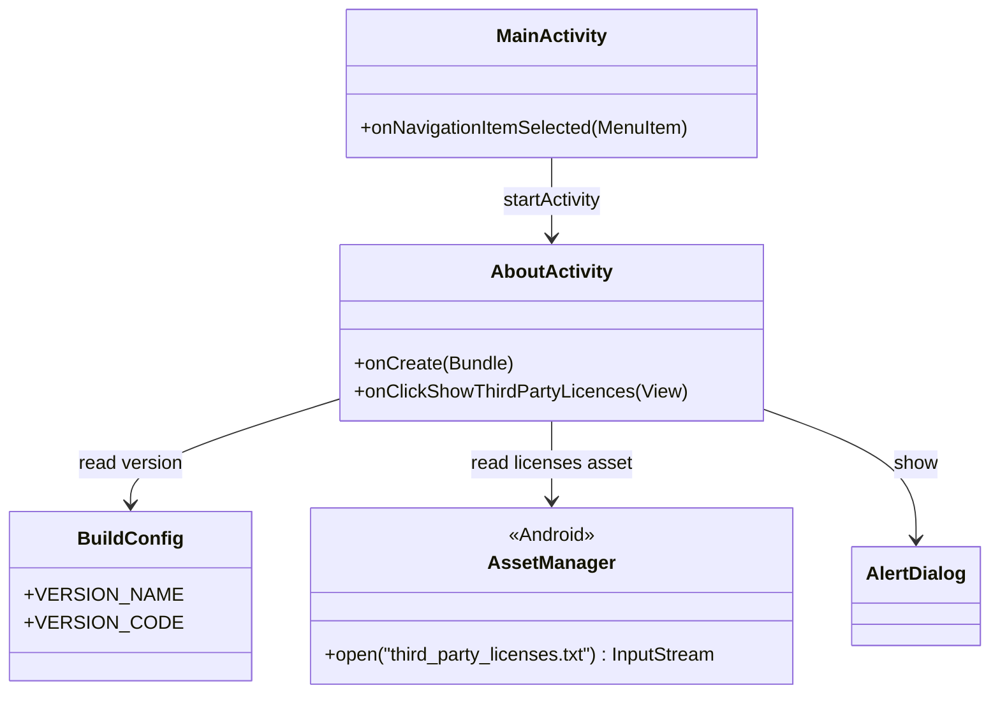
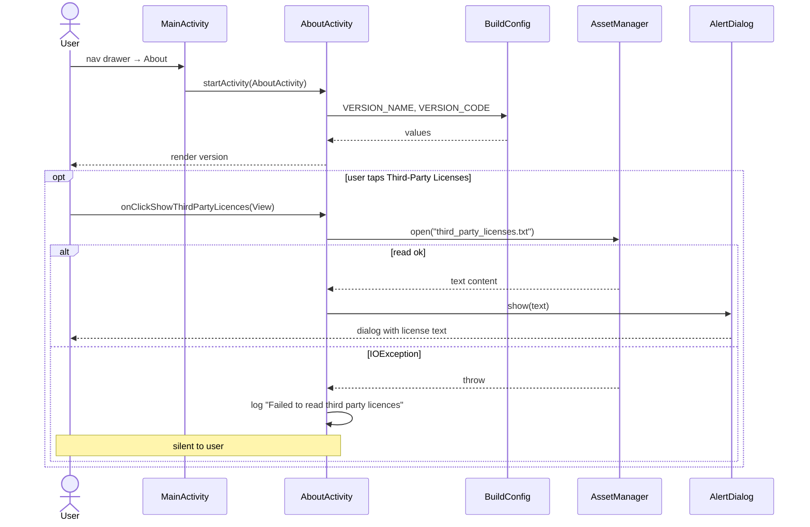

# UC9 — View About / Third-Party Licenses

Show the app version and, on demand, the bundled third-party license text.

## Actors

- **User** — opens About and optionally taps the license button
- **App** — `MainActivity`, `AboutActivity`
- **Android OS** — asset loader

## Class Diagram

## Sequence Diagram

## Explanation

1. **About screen** — Reads `BuildConfig.VERSION_NAME` and `BuildConfig.VERSION_CODE` at `onCreate` and renders them.
2. **License dialog** — On button click, opens `third_party_licenses.txt` from the app's `assets/`, reads it, and shows it in an `AlertDialog`. The file is bundled at build time (see `third_party_licenses.txt` at the project root).
3. **Silent failure** — Any `IOException` reading the asset is logged (`"Failed to read third party licences"`) but not surfaced to the user. Given the asset is bundled, this is essentially unreachable in practice.

## Error Paths

| Cause | Handling |
|-------|----------|
| `IOException` on asset read | Logged only; no dialog shown |

## Files

- [app/src/main/java/net/tpky/demoapp/AboutActivity.java](../app/src/main/java/net/tpky/demoapp/AboutActivity.java)
- [app/src/main/java/net/tpky/demoapp/MainActivity.java](../app/src/main/java/net/tpky/demoapp/MainActivity.java)
- Layout: [app/src/main/res/layout/activity_about.xml](../app/src/main/res/layout/activity_about.xml)
- Asset: [third_party_licenses.txt](../third_party_licenses.txt)
